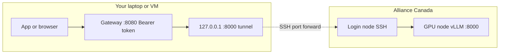

<p align="center">
  <picture>
    <source media="(prefers-color-scheme: dark)" srcset="assets/logo-white.svg">
    <source media="(prefers-color-scheme: light)" srcset="assets/logo-dark.svg">
    
  </picture>
</p>

<p align="center">
  <a href="https://github.com/sina-marefat/compute-canada-llm-gateway/releases/latest"></a>
  <a href="https://github.com/sina-marefat/compute-canada-llm-gateway"></a>
  
</p>

# :writing_hand: Introduction

Stage **vLLM** on [Alliance / Compute Canada](https://docs.alliancecan.ca/) (SLURM), then run a **token-protected gateway** on your VM that proxies OpenAI- and Anthropic-style HTTP to the GPU node over an **SSH tunnel**.

## Architecture

Your **laptop or VM** keeps an SSH **local forward** (e.g. `-L 8000:gpu-node:8000` via the login host) so `127.0.0.1:8000` reaches **vLLM on the compute node**. The **gateway** listens on another port (e.g. `0.0.0.0:8080`), checks a **Bearer token**, and forwards HTTP to that tunnel. Clients use the gateway; only SSH reaches the cluster.




> **Disclaimer.** For **research and teaching** only—not a commercial product, **no warranty**, **not affiliated** with the Alliance, Compute Canada, vLLM, or vendors. You are responsible for **cluster rules**, **allocations**, **data**, and **network exposure**. Not production or compliance advice.

**Features:** SSH forward to vLLM · gateway on `0.0.0.0:<proxy-port>` with Bearer auth · `POST /v1/chat/completions` (incl. streaming SSE) · `POST /v1/messages` (Anthropic shape, **non-stream** in v0.1).

**Demo:** [walkthrough video (Google Drive)](https://drive.google.com/file/d/1ONu7hOPw5cgjRhXlI14QpIF_6pqR_3Dg/view?usp=sharing)

**Docs (on the VM):** Swagger `http://<vm>:<proxy>/docs` · OpenAPI `…/openapi.json` · ReDoc `…/redoc` · set `PROTECT_DOCS=true` to require the same Bearer token for those URLs.

---

## Requirements

- Python **3.10+**, **SSH** to the login node (see [SSH + Duo](#ssh-and-duo-mfa)).
- A SLURM **account** and GPU **preset** in `config/nodes.yaml`.

```bash
python3 -m venv .venv && source .venv/bin/activate
pip install -e ".[dev]"
```

---

## Quick start

### SSH and Duo (MFA)

Scripts use **non-interactive** SSH. With Duo, open a **ControlMaster** first (one interactive login), then point `CC_SSH_CONTROL_SOCKET` or `ssh_control_socket` in YAML at that socket. If the socket is missing you get **exit 2**; use `--allow-no-control-socket` only if you truly have no MFA.

```bash
ssh -M -S ~/.ssh/cm-rorqual -o ServerAliveInterval=60 -fN you@<login-host>
# Approve Duo when prompted. Later: ssh -S ~/.ssh/cm-rorqual -O exit you@<login-host>
```

### Configure

```bash
cp config/nodes.example.yaml config/nodes.yaml
# Edit: ssh_host, ssh_user, slurm_account, presets, optional hf_hub_weights_parent, modules …
```

<details>
  <summary><strong>YAML field reference</strong></summary>

| Field                                           | Role                                                                                                                                |
| ----------------------------------------------- | ----------------------------------------------------------------------------------------------------------------------------------- |
| `ssh_host`, `ssh_user`                          | Login target                                                                                                                        |
| `slurm_account`                                 | `#SBATCH --account=`                                                                                                                |
| `python_module`                                 | `module load` before remote venv                                                                                                    |
| `remote_subdir`                                 | Under `$HOME`, each run gets a new id folder                                                                                        |
| `hf_hub_weights_parent`                         | Optional: reuse HF snapshots under `$HOME/<parent>/<org>--<repo>/` across runs                                                      |
| `extra_login_modules` / `extra_compute_modules` | `module load` on login vs inside the job (e.g. CUDA). OpenCV + vLLM: see [Alliance OpenCV](https://docs.alliancecan.ca/wiki/OpenCV) |
| `extra_vllm_cli`                                | Extra args after `--dtype auto` (e.g. `--tensor-parallel-size 8`)                                                                   |
| `presets`                                       | `id`, `partition`, `gpus_per_node`, `mem`, …                                                                                        |

Use `module spider` on the cluster for real module and GPU GRES strings.

</details>

### Submit vLLM (`cc_submit_vllm.py`)

```bash
python scripts/cc_submit_vllm.py --config config/nodes.yaml
```

Non-interactive example:

```bash
export HF_TOKEN=hf_…   # only if the Hub repo is gated
python scripts/cc_submit_vllm.py --config config/nodes.yaml \
  --non-interactive --preset rorqual_h100_full_1 \
  --model meta-llama/Llama-3.2-1B-Instruct --port 8000 --walltime 4:00:00
```

The script stages files on the login node, may run `snapshot_download`, runs a quick **offline/speculators** preflight, then **`sbatch`**. **Stdout** = job id only. GPU jobs do **not** run `pip`; weights must be usable offline on compute (`HF_HUB_OFFLINE=1` in the job).

### Tunnel + gateway (`cc_run_gateway.py`)

When the job is **RUNNING**, on the VM:

```bash
export GATEWAY_TOKEN="long-random-secret"   # optional; else printed once

python scripts/cc_run_gateway.py \
  --config config/nodes.yaml \
  --pick-job \
  --server-port 8000 \
  --forwarded-port 18000 \
  --proxy-port 8080
```

`UPSTREAM_BASE_URL` is set to `http://127.0.0.1:<forwarded-port>`. Use `scontrol show job <id>` if `squeue` nodelist is abbreviated.

### Call the API

```bash
curl -sS http://<vm>:8080/v1/chat/completions \
  -H "Authorization: Bearer $GATEWAY_TOKEN" \
  -H "Content-Type: application/json" \
  -d '{"model":"<vllm-model-id>","messages":[{"role":"user","content":"Hi"}],"stream":false}'
```

Anthropic-shaped (non-stream): `POST /v1/messages` with `model`, `max_tokens`, `messages`.

---

## Security (VM)

- Forward binds to **127.0.0.1** so only the VM reaches vLLM directly.
- Expose **`proxy-port`** (or TLS in front), not the raw forward port, to the internet.
- Gateway does not terminate TLS; rotate `GATEWAY_TOKEN` if leaked.

---

## SLURM job layout (what gets staged)

Each run lives under `$HOME/<remote_subdir>/<run-id>/` on the login node. That directory is **`SLURM_SUBMIT_DIR`** on the GPU job.

<details>
  <summary><strong>Staged tree and <code>vllm_job.sh</code> outline</strong></summary>

```
$HOME/<remote_subdir>/<run-id>/
├── venv/                          # built on login; same venv used on compute
├── hf_home/                       # HF cache dir for the job (HF_HOME)
├── hf_model_cache/                # per-run weights if not using shared parent
├── opencv_python_headless_stub/   # only when YAML lists OpenCV (Alliance stub)
├── requirements-login.txt
├── requirements-vllm.txt
├── vllm_job.sh                    # rendered from templates/vllm_sbatch.sh.j2
└── vllm_node_info.txt             # appended at job start (node, port, model)

vllm_job.sh
├── #SBATCH  account, partition, walltime, nodes=1, cpus, mem, gpus-per-node, …
├── cd "${SLURM_SUBMIT_DIR}"
├── module load  python + extra_compute_modules (e.g. cuda)
├── source venv/bin/activate
├── export HF_HOME=…/hf_home
├── export HF_HUB_OFFLINE=1  TRANSFORMERS_OFFLINE=1
├── MODEL_PATH=…                 # local path or $HOME/<hf_hub_weights_parent>/…
└── exec python -m vllm.entrypoints.openai.api_server --host 0.0.0.0 --port … --model "${MODEL_PATH}" …
```

Edit [`templates/vllm_sbatch.sh.j2`](templates/vllm_sbatch.sh.j2) for Apptainer, different GRES, or extra exports.

</details>

---

## Limitations (v0.1)

- `/v1/messages` **streaming** is not supported; use `/v1/chat/completions` with `stream: true`.
- `squeue` hostname pick is best-effort; use `--compute-host` if needed.
- Alliance module and wheel policies change—verify against current docs.
- Job template is **single-node**; multi-node vLLM is not automated here.
- **MIG + vLLM:** see [FAQ — MIG](#faq-mig).

---

## FAQ

<a id="faq-gated"></a>

### How do I pull a gated Hugging Face model?

<details>
  <summary><strong>Steps: license, token, export on submit host</strong></summary>

1. On the Hugging Face website, **accept the model license** and request access if the card says gated.
2. Create a **read** token at [huggingface.co/settings/tokens](https://huggingface.co/settings/tokens).
3. On the machine where you run `cc_submit_vllm.py`, export **`HF_TOKEN`** or **`HUGGING_FACE_HUB_TOKEN`** (e.g. `export HF_TOKEN=hf_…`).
4. Run submit as usual; the script uses that env on the **login node** for `snapshot_download`. It is not written into `nodes.yaml`.

For **`meta-llama/...`** and similar, the token must be valid for that repo or download fails.

</details>

---

<a id="faq-every-run"></a>

### Should I download the model on every run?

<details>
  <summary><strong>Shared <code>hf_hub_weights_parent</code> vs per-run cache</strong></summary>

**No, if you can avoid it.** Each run uses a **new** folder under `remote_subdir`, so the default per-run **`hf_model_cache/`** would re-fetch unless you skip or reuse.

- Set **`hf_hub_weights_parent`** in `nodes.yaml` (e.g. `cc-llm-hf-weights`). For a Hub id like `org/model`, weights go under `$HOME/<parent>/org--model/` and **later runs reuse** that tree; the job points `--model` there.
- Or use **`--skip-download`** when weights already exist at the path the job will use.

</details>

---

<a id="faq-pull-errors"></a>

### Why do I get an error pulling or downloading the model?

<details>
  <summary><strong>Symptom table and common fixes</strong></summary>

| Symptom | What to check |
|--------|----------------|
| **401 / 403** | Gated model: token missing, expired, or license not accepted on HF. |
| **Exit 3** before `sbatch` | `snapshot_download` failed. Fix token/network, or **`--skip-download`** / **`--ignore-hf-download-errors`** if weights are already on disk. |
| **Exit 4** before `sbatch` | Preflight found **`speculators_config`** with a **Hub-only verifier** that would break offline on the GPU node. Clean or re-download weights ([see below](#faq-different-hub)). |
| **No internet on login** | Download must succeed where you run submit; GPU nodes are often offline-only. |

Broken remote **`venv`**: **`--fresh-venv`** or delete `…/venv` on the cluster and re-submit.

</details>

---

<a id="faq-different-hub"></a>

### vLLM shows a different Hub repo, or `LocalEntryNotFoundError` offline

<details>
  <summary><strong>Bash <code>\</code> continuation vs <code>speculators_config</code></strong></summary>

**A) Bash line continuation (fixed in current template)**  
If **`slurm-*.out`** shows **`non-default args: {'host': '0.0.0.0'}`** only, **`--model` may never have reached Python**: a **blank line** between a line ending in `\` and the next argument ends the continued command in bash, so vLLM fell back to its **default** model (e.g. `Qwen/Qwen3-0.6B` in vLLM 0.20.x). Use a current [`templates/vllm_sbatch.sh.j2`](templates/vllm_sbatch.sh.j2) (uses `MODEL_PATH` + no blank line inside `exec … \` continuations) or remove blank lines in `vllm_job.sh`.

**B) Speculators / verifier on disk**  
If the banner or errors reference **another** Hub id while your **`--model`** path is correct, **`config.json`** under that path may include **`speculators_config`** pointing at a verifier on Hugging Face. With **`HF_HUB_OFFLINE=1`** on compute, that becomes **`LocalEntryNotFoundError`**. On the login node:

```bash
grep -n speculators_config "$HOME/<your-weights-dir>/config.json" || true
```

Re-download a clean snapshot or use weights without that block. Official model cards usually match the upstream `config.json` on Hugging Face.

</details>

---

<a id="faq-mig"></a>

### vLLM on Slurm MIG: `invalid literal for int() … 'MIG-…'`

<details>
  <summary><strong>Why <code>MIG-…</code> UUIDs break vLLM 0.20 and what to do</strong></summary>

Slurm **MIG** jobs often set **`CUDA_VISIBLE_DEVICES`** to a **`MIG-…`** UUID. **vLLM 0.20.x** still does **`int(...)`** on device ids in places and crashes. This is **not** your model files being wrong.

**Mitigation:** request a **full GPU** (e.g. preset **`rorqual_h100_full_1`**, `#SBATCH --gpus-per-node=h100:1`) or a vLLM build known to handle MIG UUIDs on your site. See [vLLM #13815](https://github.com/vllm-project/vllm/issues/13815). Tiny **1g** slices are rarely enough VRAM for real serving anyway.

</details>

---

## License

Use and modify for your research group; add a license file if you redistribute.