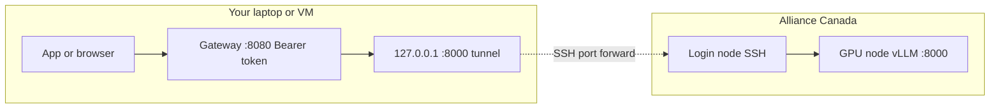

# cc-llm-gateway

## Architecture

Your **laptop or a small VM** runs an SSH **local forward** (for example `-L 8000:gpu-node:8000` through the login host) so that `127.0.0.1:8000` on that machine reaches **vLLM on the GPU compute node**. The **gateway** listens on a separate port (for example `0.0.0.0:8080`), checks a **Bearer token**, and forwards HTTP to that local tunnel endpoint. Clients therefore talk to the gateway over the VM’s network; only SSH carries traffic into the cluster—vLLM is not meant to be opened directly to the public internet.



> **Disclaimer.** This repository is shared **only to make research and teaching workflows easier** on national HPC systems. It is **not for commercial use** as a product or service offering, carries **no warranty** (fitness, security, or availability), and is **not affiliated with** the Alliance, Compute Canada, vLLM, or any vendor. You remain responsible for **cluster policies**, **accounting and allocation rules**, **data protection**, and how you expose network services. Do not treat this as production infrastructure, compliance guidance, or a substitute for official documentation and support from your institution or the Alliance.

Deploy a **vLLM** OpenAI-compatible server on [Alliance / Compute Canada](https://docs.alliancecan.ca/) (SLURM), then run the **Python gateway** on your VM so that it:

- SSH **local forwards** the compute node’s vLLM port to `127.0.0.1` on the VM (not meant to be exposed publicly).
- Listens on **`0.0.0.0:proxy-port`** with **Bearer token** authentication for API traffic.
- Proxies **OpenAI**-style `POST /v1/chat/completions` (including `stream: true` SSE).
- Adapts **Anthropic**-style `POST /v1/messages` to the upstream OpenAI API (non-streaming only in v0.1).

Swagger UI: **`http://<vm-ip>:<proxy-port>/docs`**  
OpenAPI JSON: **`http://<vm-ip>:<proxy-port>/openapi.json`**  
ReDoc: **`http://<vm-ip>:<proxy-port>/redoc`**

Set `PROTECT_DOCS=true` to require the same Bearer token for `/docs`, `/redoc`, and `/openapi.json`.

---

## Requirements

- **Python 3.10+** on your laptop/VM.
- **SSH** access to your cluster login node (SSH keys). Clusters with **Duo / MFA** need an SSH **ControlMaster** socket; see [SSH and Duo (MFA)](#ssh-and-duo-mfa) below.
- A valid SLURM **account** (`def-*`, `rrg-*`, etc.) and GPU **partition** settings in your config.

Install the project (from this repo):

```bash
python3 -m venv .venv
source .venv/bin/activate   # Windows: .venv\Scripts\activate
pip install -e ".[dev]"
```

---

## Quick start

### SSH client configuration (optional)

Multi-hop access is common. Example `~/.ssh/config` fragment:

```
Host cc-login
  HostName <your_login_host>
  User <your_cc_username>
  IdentityFile ~/.ssh/id_ed25519

Host cc-compute-proxy
  HostName <your_login_host>
  User <your_cc_username>
  ProxyJump cc-login
```

Use `cc-login` as `--login-host` if you add a `Host` alias (the scripts accept the same string you would pass to `ssh`).

### SSH and Duo (MFA)

Alliance login nodes often require **Duo** (keyboard-interactive: you type `1` and approve the push). The helper scripts run **non-interactive** `ssh`/`scp` (no TTY), so Duo cannot run inside the script. They also reuse **`BatchMode=yes`** when a multiplex socket is set, which is correct only **after** you are already authenticated.

**`cc_submit_vllm.py` and `cc_run_gateway.py` require a ControlMaster socket by default.** The path must exist on disk and be a **Unix socket** (exit code **2** with an explanation if it is missing or wrong). Use **`--allow-no-control-socket`** only if your login truly does not need MFA (unusual on Alliance).

**Recommended workflow:** open a **persistent master** connection in one terminal (complete Duo once), then point the scripts at that socket.

**Terminal A — master (leave running, or use `-fN` in the background):**

```bash
# Pick a stable path for the socket file (no directory: use a path in ~/.ssh/)
ssh -M -S ~/.ssh/cm-rorqual-msina -o ServerAliveInterval=60 -fN msina@rorqual.alliancecan.ca
```

Complete Duo when prompted (`Passcode or option: 1`, then approve on the phone). The `-fN` fork puts SSH in the background; the socket remains until you `ssh -S ~/.ssh/cm-rorqual-msina -O exit msina@rorqual.alliancecan.ca` or kill the master.

**Terminal B — submit / gateway:**

```bash
export CC_SSH_CONTROL_SOCKET=~/.ssh/cm-rorqual-msina
python scripts/cc_submit_vllm.py --config config/nodes.yaml
# or pass explicitly:
python scripts/cc_submit_vllm.py --ssh-control-socket ~/.ssh/cm-rorqual-msina ...
python scripts/cc_run_gateway.py --ssh-control-socket ~/.ssh/cm-rorqual-msina ...
```

You can also set **`ssh_control_socket`** in `config/nodes.yaml` (same path rules as the flag) for `cc_submit_vllm.py` only.

### 1. Configure cluster presets

Copy the example and edit SSH host, username, SLURM account, partitions, and resources:

```bash
cp config/nodes.example.yaml config/nodes.yaml
```

Fields:

| Field | Purpose |
|--------|---------|
| `ssh_host` | Login node hostname |
| `ssh_user` | Your cluster username |
| `slurm_account` | `#SBATCH --account=` |
| `python_module` | `module load` before activating the remote venv (e.g. `python/3.11`) |
| `remote_subdir` | Directory under `$HOME` where each run is staged |
| `hf_hub_weights_parent` | Optional. If set (e.g. `cc-llm-hf-weights`), Hugging Face snapshots for repo-style `--model` ids are stored under `$HOME/<parent>/<org>--<repo>/` and **reused across runs**; the SLURM job uses that path as `--model` so compute nodes do not re-download. Omit to keep the previous behaviour (weights only under each run’s `hf_model_cache/`). |
| `ssh_control_socket` | Path to SSH ControlMaster socket (read by `cc_submit_vllm.py`; same as `CC_SSH_CONTROL_SOCKET` / `--ssh-control-socket`) |
| `extra_login_modules` | After `python_module`: each line is one `module load …` (space-separated names share one invocation). Include **`gcc opencv/x.y.z`** when installing vLLM with **`pip --no-index`** on Alliance (see [OpenCV](https://docs.alliancecan.ca/wiki/OpenCV)). OpenCV lines are loaded **before** `python3 -m venv` so pip does not hit **`opencv-noinstall`**. |
| `extra_compute_modules` | List of `module load` names **inside the SLURM job** before `vllm` (e.g. `cuda/…`). **No `pip` runs on compute** — many Rorqual GPU nodes have no outbound internet. |
| `extra_vllm_cli` | Optional list of extra arguments appended to `vllm … api_server` after `--dtype auto` (e.g. `--trust-remote-code`). |
| `presets` | Named profiles (`id`, `partition`, …); each preset may override `extra_login_modules` / `extra_compute_modules` / `extra_vllm_cli` |

Alliance documentation for modules, GPU syntax, and `pip install --no-index` is authoritative. Use `module spider` on the login node to pick versions for your YAML.

### 2. Submit the vLLM job (script A)

Interactive (prompts for preset, port, model, walltime):

```bash
python scripts/cc_submit_vllm.py --config config/nodes.yaml
```

Non-interactive (set `HF_TOKEN` if the model is gated):

```bash
export HF_TOKEN=hf_xxxxxxxx
python scripts/cc_submit_vllm.py --config config/nodes.yaml \
  --non-interactive --preset rorqual_h100_full_1 \
  --model meta-llama/Llama-3.2-1B-Instruct --port 8000 --walltime 4:00:00
```

### Gated Hugging Face models

For **`meta-llama/...`** and other gated repos, create a read token at [https://huggingface.co/settings/tokens](https://huggingface.co/settings/tokens), accept the model license on the model page, then export **`HF_TOKEN`** (or **`HUGGING_FACE_HUB_TOKEN`**) in the shell where you run `cc_submit_vllm.py`. The token is only exported on the login node for the download step.

If `snapshot_download` fails, the script **exits before `sbatch`** (code **3**) unless you use **`--skip-download`** (weights already at the job’s model path: per-run `hf_model_cache/`, or the shared `$HOME/<hf_hub_weights_parent>/…` tree when configured) or **`--ignore-hf-download-errors`**.

If **`config.json`** for those weights contains **`speculators_config`** whose **`verifier.name_or_path`** looks like a Hugging Face repo id (e.g. `Qwen/Qwen3-0.6B`), **`cc_submit_vllm.py` exits before `sbatch` (code 4)**: the generated job sets **`HF_HUB_OFFLINE=1`**, so vLLM cannot download that verifier on the GPU node (you would otherwise see **`LocalEntryNotFoundError`** or **`Network is unreachable`**). Fix the weights directory as described under «vLLM logs a *different* Hugging Face repo» below.

### Reusing weights across runs

Each submission creates a **new** directory under `remote_subdir` (a new random id). By default, weights go only into that run’s **`hf_model_cache/`**, so the **next** submission downloads the snapshot again.

- **Shared directory (recommended):** set **`hf_hub_weights_parent`** in `nodes.yaml` (for example `cc-llm-hf-weights`). For Hugging Face repo ids such as `deepseek-ai/DeepSeek-R1-Distill-Qwen-1.5B`, snapshots are stored under `$HOME/<parent>/deepseek-ai--DeepSeek-R1-Distill-Qwen-1.5B/` and **reused**; the SLURM script passes **`--model "${HOME}/…"`** to that path. A later `snapshot_download` into an existing tree is usually cheap (cache / missing files only).
- **Skip download:** use **`--skip-download`** when weights are already on disk at the path the job will use (shared tree above, or your own **`--model`** path).

The script:

1. SSHs to the login node and creates `$HOME/<remote_subdir>/<run-id>/`.
2. Uploads [`requirements-login.txt`](requirements-login.txt), [`requirements-vllm.txt`](requirements-vllm.txt), and a generated `vllm_job.sh`. When your config lists OpenCV, it also uploads [`packaging/opencv_python_headless_stub/`](packaging/opencv_python_headless_stub/) so pip can satisfy vLLM’s **`opencv-python-headless`** requirement without downloading Alliance’s **`opencv-noinstall`** dummy wheel (real **`import cv2`** still comes from **`module load opencv`**).
3. On the **login node** (has internet): `module load` your `python_module`, then all **`extra_login_modules`** (including OpenCV **before** creating the venv); **`python3 -m venv`** (with **`--system-site-packages`** when an OpenCV line is listed). **When an OpenCV line is present**, installs use **`source venv/bin/activate && pip install --no-index …`** (Alliance OpenCV wiki — the dummy wheel expects an activated venv). Otherwise **`"${PWD}/venv/bin/python" -m pip install --no-index …`**. OpenCV-related lines are **`module load`**ed again immediately before installing the stub and vLLM if listed. It **`pip install`s the stub directory**, then vLLM with **`--no-build-isolation`** when an OpenCV line is present.
4. Optionally runs **`snapshot_download`** into `hf_model_cache/` in the run directory, or into **`$HOME/<hf_hub_weights_parent>/…`** when that config key is set (see «Reusing weights across runs»).
5. Runs a **speculators / offline preflight** on the login node (reads `config.json` under the weight path); exits **4** if a Hub-only verifier would break **`HF_HUB_OFFLINE=1`** on compute.
6. Runs **`sbatch`**. The **compute** script **does not run `pip`** (GPU nodes often have **no outbound internet**); it only `module load`s (Python + **`extra_compute_modules`** such as CUDA), activates the same `venv`, and starts vLLM.

If a previous attempt left a broken `venv`, use **`--fresh-venv`** or `rm -rf …/venv` on the cluster before re-running.

**Stdout** is only the job ID (easy to script); progress messages go to stderr.

### 3. Wait for `RUNNING`, resolve compute host

On the login node (or via SSH):

```bash
squeue -u $USER
# When ST is RUNNING, note NODELIST / node name used for port forwarding.
```

The hostname used in SSH `-L` must be reachable **from the login node** to the compute node (short name or FQDN per your site). If `squeue` shows an abbreviated nodelist (e.g. `cn[001-002]`), pick the actual first node or use `scontrol show job <jobid>`.

### 4. Tunnel + gateway (script B) on the VM

Bind the forward to loopback only; expose only the gateway port in your cloud firewall / security group.

```bash
export GATEWAY_TOKEN="choose-a-long-secret"   # optional; if omitted, a token is generated and printed

python scripts/cc_run_gateway.py \
  --login-host <login.example.ca> \
  --user <cc_username> \
  --compute-host <compute_short_name> \
  --server-port 8000 \
  --forwarded-port 18000 \
  --proxy-port 8080
```

You can pass **`--config config/nodes.yaml`** so **`ssh_host`**, **`ssh_user`**, and **`ssh_control_socket`** come from the same file as `cc_submit_vllm.py` (CLI flags override YAML). **Pick a job interactively** to fill in the compute host from `squeue` (prefers `RUNNING` jobs):

```bash
python scripts/cc_run_gateway.py \
  --config config/nodes.yaml \
  --pick-job \
  --server-port 8000 \
  --forwarded-port 18000 \
  --proxy-port 8080
```

Same with explicit login instead of `--config`:

```bash
python scripts/cc_run_gateway.py \
  --login-host <login> --user <you> \
  --pick-job \
  --server-port 8000 \
  --forwarded-port 18000 \
  --proxy-port 8080
```

Environment variables read by the gateway:

| Variable | Meaning |
|----------|---------|
| `UPSTREAM_BASE_URL` | Set automatically by script B to `http://127.0.0.1:<forwarded-port>` |
| `GATEWAY_TOKEN` | Static API token (optional) |
| `PROTECT_DOCS` | If `true`, `/docs`, `/redoc`, `/openapi.json` require Bearer auth |

### 5. Call the API

**OpenAI-compatible** (streaming supported):

```bash
curl -sS http://<vm>:8080/v1/chat/completions \
  -H "Authorization: Bearer $GATEWAY_TOKEN" \
  -H "Content-Type: application/json" \
  -d '{"model":"<same-as-vllm>","messages":[{"role":"user","content":"Hello"}],"stream":false}'
```

**Anthropic-compatible** (non-stream only in v0.1):

```bash
curl -sS http://<vm>:8080/v1/messages \
  -H "Authorization: Bearer $GATEWAY_TOKEN" \
  -H "Content-Type: application/json" \
  -d '{"model":"<same-as-vllm>","max_tokens":256,"messages":[{"role":"user","content":"Hello"}]}'
```

---

## Security notes (VM)

- The SSH forward uses **`127.0.0.1:<forwarded-port>`** so only local processes on the VM can hit vLLM directly.
- Open only **`proxy-port`** to the internet (or place nginx/Caddy with TLS in front of that port).
- **TLS** is not terminated inside this gateway; use a reverse proxy for HTTPS in production.
- Rotate `GATEWAY_TOKEN` if leaked; logs may contain request metadata—avoid logging full prompts in shared environments.

---

## SLURM job template

The batch script is rendered from [`templates/vllm_sbatch.sh.j2`](templates/vllm_sbatch.sh.j2). It:

- `cd`’s to `$SLURM_SUBMIT_DIR` (your staged run directory).
- Loads your Python module and **`extra_compute_modules`** (e.g. CUDA) from config or preset.
- Activates the **existing** `./venv` and sets **`HF_HOME`**, **`HF_HUB_OFFLINE=1`**, and **`TRANSFORMERS_OFFLINE=1`** so vLLM/transformers do not call the public internet on GPU nodes (many sites have no outbound route).
- Runs: `python -m vllm.entrypoints.openai.api_server …`, optionally appending CLI tokens from **`extra_vllm_cli`** in YAML (preset or top-level; same merge rules as module lists), e.g. `--trust-remote-code`.

### vLLM logs a *different* Hugging Face repo (`Network is unreachable`)

If **`slurm-*.out`** shows **`non-default args: {'host': '0.0.0.0'}`** (or otherwise only `host`) while **`vllm_job.sh`** clearly passes **`--model`**, the shell may never have passed **`--model`** to Python: in **`bash`**, a **blank line** inside a command continued with **`\` at end of line`** ends the continued command, so later lines such as **`--model …`** are executed as separate commands (often **`--model: command not found`**) or ignored. Older copies of this repo’s Jinja template accidentally emitted that blank line between **`--port … \`** and **`--model …`**, so vLLM fell back to its **default** model (for example **`Qwen/Qwen3-0.6B`** in vLLM 0.20.x) and then failed offline with **`LocalEntryNotFoundError`**. Re-submit with a current [`templates/vllm_sbatch.sh.j2`](templates/vllm_sbatch.sh.j2) (or hand-edit **`vllm_job.sh`** so no blank line appears between a **` \`** line and the next argument).

If vLLM really is loading your weight directory but **`slurm-*.err`** still shows it fetching a **different** Hub id than you expect, recent vLLM may be following a **`speculators_config`** block inside your weights’ **`config.json`**: it treats the directory as a *speculators* draft and swaps the engine to the **verifier** model named there, which still lives on Hugging Face.

On the **login node**, inspect the tree vLLM uses (your run’s `hf_model_cache/` or **`$HOME/<hf_hub_weights_parent>/…`**):

```bash
grep -n speculators_config "$HOME/cc-llm-hf-weights/deepseek-ai--DeepSeek-R1-Distill-Qwen-1.5B/config.json" || true
```

The [official](https://huggingface.co/deepseek-ai/DeepSeek-R1-Distill-Qwen-1.5B/raw/main/config.json) **DeepSeek-R1-Distill-Qwen-1.5B** `config.json` does **not** include `speculators_config`. If yours does, re-download a clean snapshot (`snapshot_download` / re-run submit without `--skip-download`), or point **`--model`** at a path you know is a plain HF model directory.

With **`HF_HUB_OFFLINE=1`** on compute (see the SLURM template), the same misconfiguration surfaces as **`huggingface_hub.errors.LocalEntryNotFoundError`** (“outgoing traffic has been disabled”) when vLLM tries to **`snapshot_download`** the verifier. **`cc_submit_vllm.py`** runs a **preflight check** before **`sbatch`** and exits with **code 4** when it detects that pattern so you fix weights on the login node instead of wasting queue time.

### vLLM on Slurm **MIG** slices (`invalid literal for int() ... 'MIG-…'`)

If **`slurm-*.out`** or **`.err`** shows **`ValueError: invalid literal for int() with base 10: 'MIG-…'`** (often wrapped as **“Model architectures … failed to be inspected”**), Slurm has given the job an **NVIDIA MIG** instance. The scheduler typically sets **`CUDA_VISIBLE_DEVICES`** to a **MIG UUID** string. **vLLM 0.20.x** still assumes numeric GPU indices in parts of the CUDA platform code and crashes when it tries **`int('MIG-…')`**. This is unrelated to your **`config.json`** or **`Qwen2ForCausalLM`** weights.

**Mitigation:** submit on a **full-GPU** preset (for example **`rorqual_h100_full_1`** with **`#SBATCH --gpus-per-node=h100:1`** in the example config), or a larger MIG profile only if your installed vLLM version is known to work with MIG UUIDs on your site. Track upstream fixes in [vLLM issue #13815](https://github.com/vllm-project/vllm/issues/13815) and related MIG / **`device_id_to_physical_device_id`** discussions. The **1g.10GB** slice is usually too small for serious models in any case.

Edit the template if you need containers (`apptainer exec`), different GPU flags, or more `vllm` arguments.

---

## Development

```bash
pytest -q
```

---

## macOS and Linux

Scripts use Python stdlib `subprocess` for `ssh`/`scp` (no Windows support assumed). Paths use `pathlib`. Use a POSIX shell on the remote cluster.

---

## Limitations (v0.1)

- **Anthropic** `POST /v1/messages` with **`stream: true`** is rejected; use OpenAI `stream: true` through `/v1/chat/completions` instead.
- **Compute hostname** parsing from `squeue` is best-effort; complex nodelist syntax may require passing `--compute-host` manually.
- **Alliance policies** (modules, wheels-only pip, Apptainer) change over time—validate against current docs.
- **MIG + vLLM:** many vLLM releases mishandle **`CUDA_VISIBLE_DEVICES`** when it contains **`MIG-…`** UUIDs; prefer a full-GPU Slurm GRES (see «vLLM on Slurm MIG slices» above).

---

## License

Use and modify for your research group; add a license file if you redistribute.
